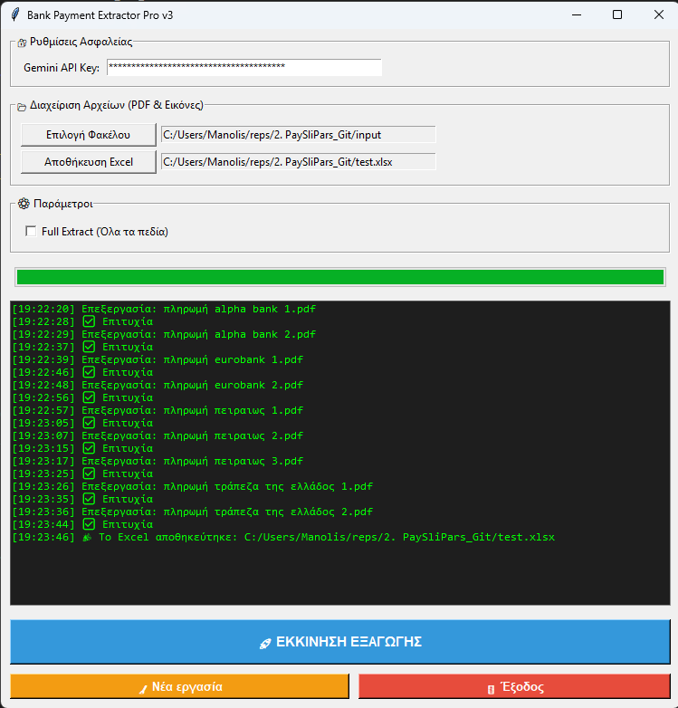
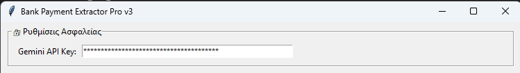
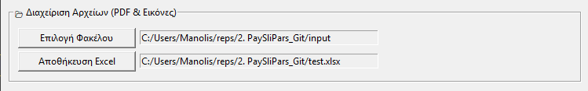
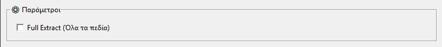
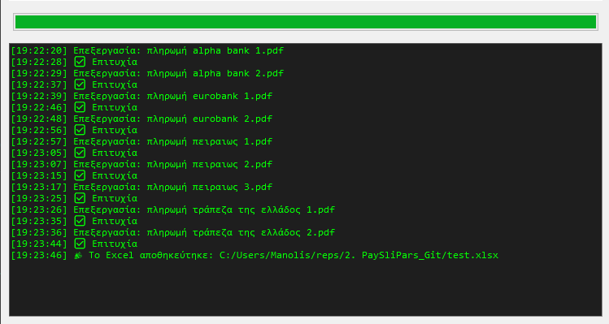

# 🧾 Εφαρμογή Εξαγωγής Δεδομένων από Παραστατικά Πληρωμών με Χρήση AI

Ελληνικό εγχειρίδιο χρήσης για την εφαρμογή **AI Payment Slip Parser**,
η οποία αυτοματοποιεί την ανάγνωση και εξαγωγή δεδομένων από παραστατικά
πληρωμών και τα καταχωρεί σε αρχείο Excel.

------------------------------------------------------------------------

# 📑 Πίνακας Περιεχομένων

1.  Εισαγωγή
2.  Βασικά Χαρακτηριστικά
3.  Απαιτήσεις Συστήματος
4.  Εγκατάσταση
5.  Οδηγός Χρήσης
    -   1.  Κεντρικό Περιβάλλον Εφαρμογής\

    -   2.  Εισαγωγή API Key\

    -   3.  Επιλογή Φακέλου Πηγής\

    -   4.  Ρυθμίσεις\

    -   5.  Πρόοδος & Καταγραφή Μηνυμάτων\

    -   6.  Κουμπιά Εκκίνησης / Νέας Εργασίας / Εξόδου
6.  Δομή Παραγόμενου Excel
7.  Αντιμετώπιση Προβλημάτων
8.  Σημειώσεις

------------------------------------------------------------------------

# 1. Εισαγωγή

Η εφαρμογή αποτελεί ένα εργαλείο τεχνητής νοημοσύνης (AI) με γραφικό
περιβάλλον (GUI), το οποίο διαβάζει παραστατικά πληρωμών (PDF ή εικόνες)
και εξάγει συγκεκριμένα πεδία σε Excel.

Απευθύνεται σε χρήστες που θέλουν να καταχωρούν, να οργανώνουν ή να
αναλύουν μεγάλο όγκο παραστατικών εύκολα και με ακρίβεια.

Η εξαγωγή περιλαμβάνει τα εξής πεδία:

-   Τράπεζα (Χρέωση)\
-   Κωδικός Συναλλαγής\
-   Ημερομηνία\
-   Ποσό\
-   Έξοδα\
-   IBAN Χρέωσης (Από)\
-   IBAN Πίστωσης (Προς)\
-   Τράπεζα (Πίστωση)\
-   Δικαιούχος Λογαριασμού Πίστωσης Ίδια Τράπεζα\
-   Όνομα Αρχείου\
-   bank_name_header

Υποστηρίζεται επίσης **δυναμική εξαγωγή**, όπου η εφαρμογή επιστρέφει
επιπλέον πεδία που εντοπίζονται από το AI.

------------------------------------------------------------------------

# 2. Βασικά Χαρακτηριστικά

-   Αυτόματη εξαγωγή δεδομένων με τεχνολογία AI\
-   Απλό και καθαρό γραφικό περιβάλλον\
-   Μαζική επεξεργασία πολλών αρχείων\
-   Επιλογή μεταξύ προκαθορισμένης και δυναμικής εξαγωγής\
-   Εμφάνιση προόδου με progress bar\
-   Αναλυτικά logs κατά την εκτέλεση\
-   Δυνατότητα επιλογής φακέλου εισόδου και εξόδου\
-   Απαιτεί μόνο ένα API key για λειτουργία

------------------------------------------------------------------------

# 3. Απαιτήσεις Συστήματος

-   Windows 10 ή 11\
-   Python 3.10 ή νεότερο\
-   Εγκατεστημένες βιβλιοθήκες από το αρχείο `requirements.txt`

------------------------------------------------------------------------

# 4. Εγκατάσταση

1.  Εγκαταστήστε Python (έκδοση 3.10 ή νεότερη).\
2.  Εγκαταστήστε τις απαιτούμενες βιβλιοθήκες:

```{=html}
<!-- -->
```
    pip install -r requirements.txt

3.  Αποκτήστε ένα έγκυρο Google Gemini API key.\
4.  Αποθηκεύστε το API key σε ένα αρχείο **api.txt** στον φάκελο της
    εφαρμογής.

------------------------------------------------------------------------

# 5. Οδηγός Χρήσης

## 5.1 Κεντρικό Περιβάλλον Εφαρμογής



## 5.2 Εισαγωγή API Key

Ο χρήστης εισάγει το API key μέσα στο αρχείο `api.txt`.



## 5.3 Επιλογή Φακέλου Πηγής

Επιλέξτε τον φάκελο που περιέχει τα παραστατικά πληρωμών.



## 5.4 Ρυθμίσεις

Επιλογές εξαγωγής και φάκελος αποθήκευσης των αποτελεσμάτων.



## 5.5 Πρόοδος & Καταγραφή Μηνυμάτων

Εμφανίζεται η πρόοδος επεξεργασίας και μηνύματα κατάστασης.



## 5.6 Κουμπιά Εκκίνησης / Νέας Εργασίας / Εξόδου

Κουμπιά έναρξης, επανεκκίνησης και εξόδου από την εφαρμογή.


------------------------------------------------------------------------

# 6. Δομή Παραγόμενου Excel

Το παραγόμενο Excel περιλαμβάνει τα εξής πεδία:

-   Τράπεζα Χρέωσης\
-   Κωδικός Συναλλαγής\
-   Ημερομηνία\
-   Ποσό\
-   Έξοδα\
-   IBAN Χρέωσης\
-   IBAN Πίστωσης\
-   Τράπεζα Πίστωσης\
-   Δικαιούχος Λογαριασμού Πίστωσης (Ίδια Τράπεζα)\
-   Όνομα Αρχείου\
-   bank_name_header

Τα δεδομένα αποθηκεύονται στον φάκελο που επιλέγει ο χρήστης.

------------------------------------------------------------------------

# 7. Αντιμετώπιση Προβλημάτων

### Το API key δεν βρέθηκε

Ελέγξτε ότι υπάρχει το αρχείο `api.txt` και ότι περιέχει σωστό API key.

### Δεν βρέθηκαν αρχεία προς επεξεργασία

Επιβεβαιώστε ότι ο φάκελος εισόδου περιέχει συμβατά αρχεία (PDF ή
εικόνες).

### Σφάλματα εξαγωγής

Ελέγξτε τα μηνύματα στο παράθυρο καταγραφής για λεπτομέρειες.

------------------------------------------------------------------------

# 8. Σημειώσεις

-   Το API key παραμένει τοπικό στον υπολογιστή σας.\
-   Στα repositories δεν ανεβαίνουν ποτέ ευαίσθητα δεδομένα (όπως API
    keys).
